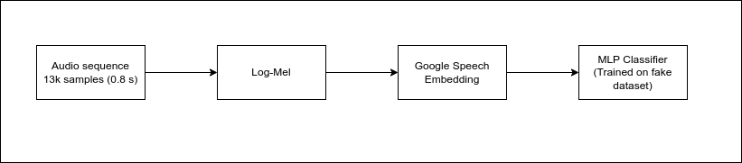
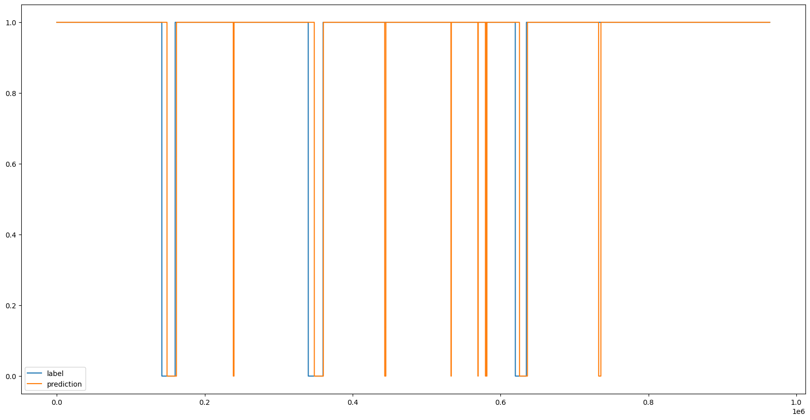

# AAICO Hackathon Submission

Team Name: Noufal
Member: Noufal - kvsnoufal@gmail.com

## Approach:

### Steps:
1. Stack samples of 13,000.
2. Generate Log Mel Spectrogram.
3. Use [Google Speech Embedding model](https://www.kaggle.com/models/google/speech-embedding) to create embeddings.
4. Use ANN model for classification.

### Running the Script:
- Running script in Colab: [Colab Link](https://colab.research.google.com/drive/1nL5BOHXoV8quGAuNwM5fub9e3FP6FSvv?usp=sharing)
- To replicate, upload all files in the `Colab Test` folder to a Google Colab notebook.
- Replace `test_aaico_challenge.wav` with test file 
- Use T4 GPU runtime.
- Recommended to run on Colab or any other machine with GPU


### Training:

#### Data Preparation:
1. Generate fake dataset using [VITS](https://github.com/jaywalnut310/vits) and [WAVEGLOW](https://github.com/NVIDIA/waveglow) models for positive samples (15k).
2. Download the [Common Voice dataset](https://huggingface.co/datasets/mozilla-foundation/common_voice_13_0) for the negative dataset (15k).
3. Add 32 seconds of the given audio file to the training dataset.

#### Model:
```python
Net(
  (flatten): Flatten(start_dim=1, end_dim=-1)
  (layer1): Linear(in_features=96, out_features=128, bias=True)
  (relu1): ReLU()
  (layernorm1): LayerNorm((128,), eps=1e-05, elementwise_affine=True)
  (blocks): ModuleList(
    (0-31): 32 x FCNBlock(
      (fcn_layer): Linear(in_features=128, out_features=128, bias=True)
      (relu): ReLU()
      (layer_norm): LayerNorm((128,), eps=1e-05, elementwise_affine=True)
    )
  )
  (last_layer): Linear(in_features=128, out_features=1, bias=True)
  (last_act): Sigmoid()
)
```

#### Loss:
- Binary Cross Entropy

#### Evaluation Metric:

Custom Score: 0.59
Precision: 0.97
Recall: 0.97


### Speeding up Inference:
1. Convert log mel spectrogram creation to PyTorch and export to ONNX.
2. Convert embedding and classification model to ONNX.
3. Warm up GPU - Latency times are high initially. This is because it's sleeping (less power allocation during idling). To address this, run some random datapoints through the model at initialization to warm up the GPU.

### Possible Further Works:
1. Test Time Augmentation: Increased the score but also latency. Need to explore parallelized approaches to TTA.
2. Cleaner Training Data: Create negative samples with random texts to have both negative and positive examples for the same voice.
3. Explore CNN-RNN based models - Avoided due to concerns about potential latency increase.

Easiest Way to reproduce is in [Colab ](https://colab.research.google.com/drive/1nL5BOHXoV8quGAuNwM5fub9e3FP6FSvv?usp=sharing) 